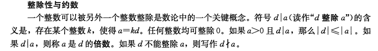
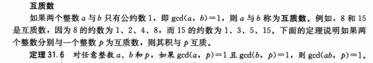
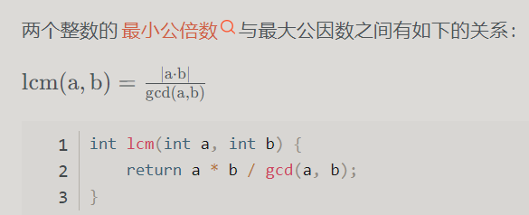

# 前置知识
约数


GCD：**两个不同时为0的整数α与b的公约数中最大的称为其最大公约数，记作gcd(a，b)。**
互质数


例如，gcd(24，30)=6，gcd(5，7)=1，gcd(0，9)=9。如果a与b不同时为0，则ged(a，b)是一个在

欧几里得法（又叫辗转相除法）
思想很简单，
```python
    while b > 0: # 欧几里得法，又叫辗转相除法
        a, b = b, a % b
```

最小公倍数（Least Common Multiple，LCM）

注意：gcd(a,0) = gcd(0,a) = a
[参考链接(要开vpn才能访问)](https://asecuritysite.com/encryption/pal_ex)

参考书籍：《算法导论》